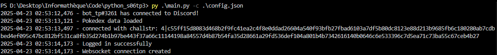
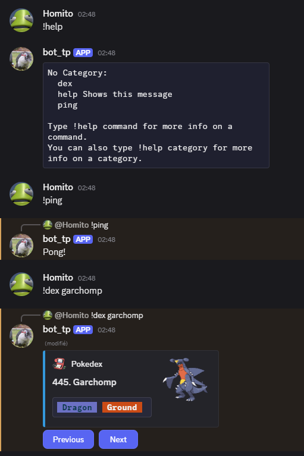

# Compte rendu TP3 Python - Yoann MAHIOUT 3A31

[lien vers le code](https://gitlab.esiea.fr/mahiout/python_s06tp3)

## Réponse aux questions
#### Qu’est-ce qu’un bot ?
Un robot, ou bot, est un ordinateur qui peut être programmé pour réaliser des tâches spécifiques, telles que répondre à des questions, fournir des informations, ou interagir avec les utilisateurs. Les bots peuvent être utilisés dans différentes applications, telles que les chats de messagerie, les assistants virtuels, ou les systèmes de recomposition d'information.
#### Qu'est ce que le logging. À quoi servent les logs?
Le logging est la pratique de journaliser des informations sur les activités d'un système informatique ou d'une application. Les logs sont utilisés pour surveiller et analyser les comportements du système, diagnostiquer des problèmes, suivre l'utilisation de l'application et améliorer sa performance.

## Fonctionnement du Bot
Le bot va utiliser les différentes APIs de Pokémon Showdown pour être utilisé comme un pokedex.
### Commandes
- `!help` : Liste de commandes supportées par le bot.
- `!dex <pokemon>` : Génère un message avec des infos sur le pokémon
- `!ping` : Le bot va répondre avec "Pong!

## Lancement
Lancez le bot avec la commande :
`python3 bot.py -c config.json`

## Execution du code
Lancement du bot via CLI (le log_level a été changé sur screen pour aider la lisibilité):

Utilisation des commandes depuis un serveur Discord :
